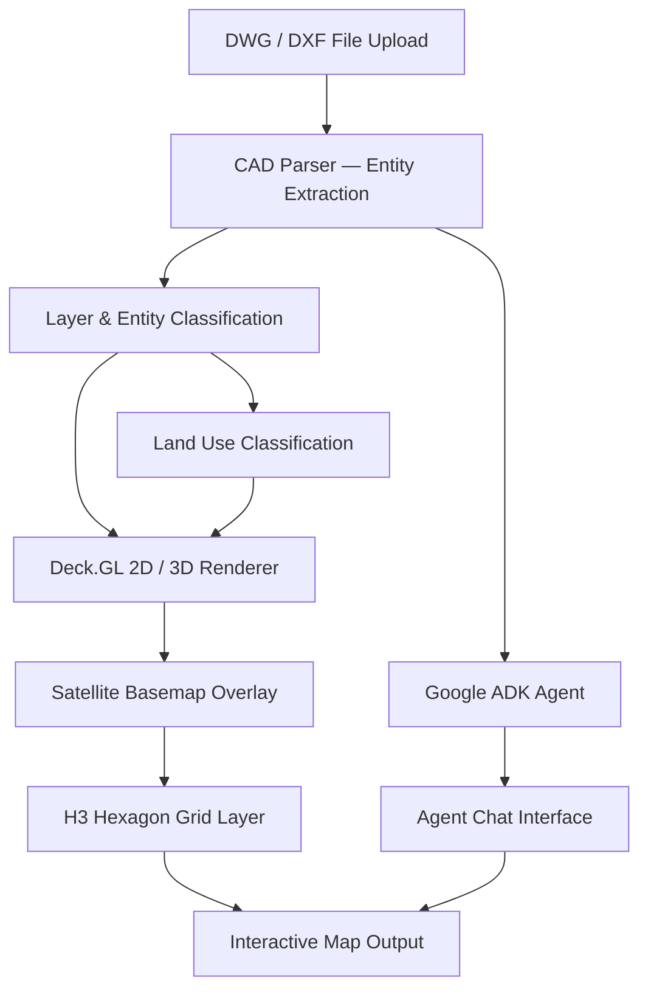

# ADK x AutoCAD - DWG/DXF Viewer with AI Agent

> Web-based AutoCAD DWG/DXF viewer that renders drawings on a satellite basemap using Deck.GL (2D/3D), overlays H3 hexagonal grids for spatial analysis, and embeds a Google ADK-powered AI agent that reads and answers questions about the drawing in real time.

---

## Overview

Working with AutoCAD DWG/DXF files in a real estate context typically requires specialist desktop software and manual interpretation. This project builds a web application that reads DWG/DXF files directly, renders them as interactive maps layered over satellite imagery via Deck.GL, and attaches a Google ADK agent that can answer questions about the drawing — layers, entity types, block references, text content, plot numbers — through a chat interface.

The system also auto-classifies land use from the drawing data (Residential, Commercial, Open Space, Education, Community, Religious, Utility, Structure) and overlays H3 hexagonal grids for spatial queries and area aggregation.

**Example file:** JANADRIYAH DMP — 46,754 entities, 60 layers, rendered in Deck.GL 2D with 19,445 shapes drawn and H3 hexagon overlay.

---

## System Architecture



---

## Tech Stack

| Layer | Technology |
|---|---|
| Map Visualization | Deck.GL (2D and 3D WebGL rendering) |
| Satellite Basemap | Esri / Maxar / Earthstar Geographics |
| Geospatial Indexing | H3.js (Uber H3 hexagonal grid) |
| CAD File Processing | DWG/DXF entity parser (46,000+ entities) |
| AI Agent | Google Agent Development Kit (ADK) |
| Land Use Classification | Layer-based auto-classification engine |
| Frontend | ReactJS, NextJS, TypeScript |
| Backend | Python, NodeJS |

---

## Key Features

- **DWG/DXF file reading** — ingests AutoCAD files directly in the browser; no desktop CAD software required
- **Deck.GL 2D / 3D rendering** — three view modes (Deck.GL 2D, Deck.GL 3D, Normal 2D) for exploring large drawings with tens of thousands of entities
- **Satellite basemap overlay** — drawing geometry rendered on top of real satellite imagery (Esri, Maxar, Earthstar Geographics) for spatial context
- **H3 hexagon grid** — toggleable H3 hexagonal overlay for spatial aggregation, area queries, and density analysis
- **Land use classification** — auto-classifies entities by land use category (Residential, Commercial, Open Space, Education, Community, Religious, Utility, Structure) with counts and color-coded legend
- **Google ADK agent chat** — right-side agent panel reads the drawing through the same API the viewer uses; answers questions like "What layers are in this drawing?", "How many block references are there?", "Find any text mentioning a plot number"
- **Entity interaction** — click any object in the drawing to inspect its properties, layer, and attributes; supports commenting per entity
- **Layer management** — browse and toggle all 60+ layers from the drawing with entity counts per layer

---

## Agent Capabilities

The embedded ADK agent can answer questions directly about the loaded DWG/DXF file:

| Question type | Example |
|---|---|
| Layer inspection | "What layers are in this drawing?" |
| Entity counting | "How many block references are there, and of what types?" |
| Text search | "Find any text mentioning a room or plot number" |
| Land use queries | "How many residential plots are in the northern section?" |
| Geometry analysis | "Which entities are on the Open Space layer?" |

---

## Project Structure

```
autocad-agentic-adk/
├── cad_parser/          # DWG/DXF entity and layer extraction
├── classification/      # Land use auto-classification engine
├── visualization/       # Deck.GL 2D/3D layer definitions
├── geospatial/          # H3.js hexagon grid integration
├── agent/               # Google ADK agent config and tool definitions
├── frontend/            # ReactJS + NextJS viewer interface
└── backend/             # Python + NodeJS API layer
```

---

## Setup

```bash
git clone https://github.com/anwarraif/autocad-agentic-adk
cd autocad-agentic-adk
pip install -r requirements.txt
npm install
cp .env.example .env
# Fill in: GOOGLE_ADK_API_KEY, GEMINI_API_KEY
npm run dev
```

---

## Author

**Kurnia Anwar Ra'if** — Senior AI Engineer  
[LinkedIn](https://www.linkedin.com/in/anwaraif/) | [GitHub](https://github.com/anwarraif) | kurniaanwarraif@gmail.com
